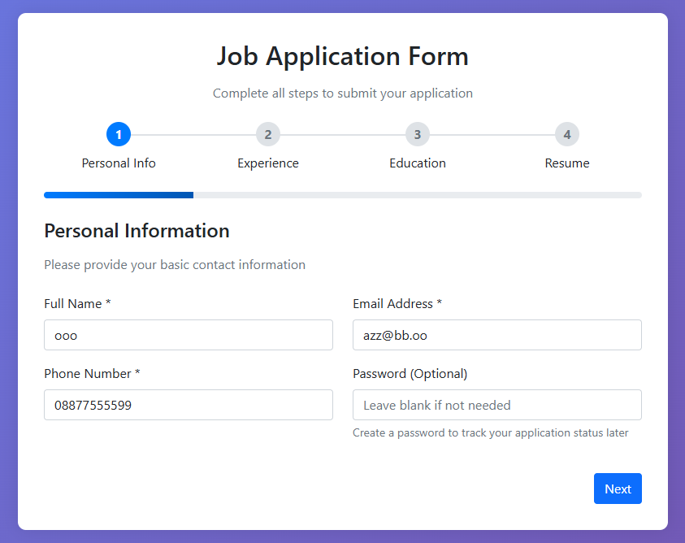

# Multi-Step Job Application Form

A Laravel-based multi-step job application form that allows users to submit their personal information, experience, education, and resume through a guided process.



## Features

- **Multi-step form process**: Personal Info → Experience → Education → Resume → Success
- **Session-based data storage**: Form data is preserved across steps
- **File upload**: Resume upload with validation
- **Comprehensive validation**: Each step has proper validation rules
- **Success page**: Displays all submitted data for review
- **Responsive design**: Works on desktop and mobile devices

## Requirements

- PHP 8.1 or higher
- Composer
- Node.js and npm
- SQLite (default) or MySQL/PostgreSQL

## Installation

### 1. Clone the Repository

```bash
git clone https://github.com/syawqy/multi-step-form.git
cd multi-step-form
```

### 2. Install PHP Dependencies

```bash
composer install
```

### 3. Install Node.js Dependencies

```bash
npm install
```

### 4. Environment Setup

```bash
# Copy the environment file
cp .env.example .env

# Generate application key
php artisan key:generate
```

### 5. Database Setup

The application is configured to use SQLite by default.

If you prefer to use MySQL or PostgreSQL, update the `.env` file:

```env
DB_CONNECTION=mysql
DB_HOST=127.0.0.1
DB_PORT=3306
DB_DATABASE=your_database_name
DB_USERNAME=your_username
DB_PASSWORD=your_password
```

### 6. Run Database Migrations

```bash
php artisan migrate
```

### 7. Create Storage Link

```bash
php artisan storage:link
```

### 8. Build Assets

```bash
npm run build
```

## Running the Application

### Development Server

```bash
php artisan serve
```

The application will be available at `http://localhost:8000`

### Asset Compilation (Development)

For development with hot reloading:

```bash
npm run dev
```

## Testing

### Run All Tests

```bash
vendor/bin/phpunit
```

### Run Specific Test

```bash
vendor/bin/phpunit --filter test_name
```

### Run Feature Tests Only

```bash
vendor/bin/phpunit tests/Feature
```

## Application Structure

### Controllers

- `JobApplicationController`: Handles all form steps and submission

### Models

- `User`: User model with factory for testing
- `Experience`: Experience data model
- `Education`: Education data model
- `Resume`: Resume file model

### Form Requests

- `PersonalInfoRequest`: Validates personal information
- `ExperienceRequest`: Validates work experience
- `EducationRequest`: Validates education information
- `ResumeRequest`: Validates resume upload

### Views

- `job-application/step1`: Personal information form
- `job-application/step2`: Experience form
- `job-application/step3`: Education form
- `job-application/step4`: Resume upload form
- `job-application/success`: Success page showing all submitted data

## Form Steps

### Step 1: Personal Information
- Full Name (required)
- Email (required, valid email)
- Phone (required)
- Address (required)

### Step 2: Experience
- Company (required)
- Role (required)
- Years of Experience (required, 0-20+ years)
- Description (required, 50-500 characters)

### Step 3: Education
- Degree (required)
- Institution (required)
- Graduation Year (required, 1950-current year)
- GPA (optional, 0.0-4.0)

### Step 4: Resume
- Resume file upload (required, PDF/DOC/DOCX, max 2MB)

### Step 5: Success
- Displays all submitted information
- Shows uploaded resume filename
- Provides confirmation of successful submission

## File Storage

Resumes are stored in `storage/app/private/resumes/` directory. The storage link ensures proper access to uploaded files.

## Session Management

Form data is stored in the session under the `job_application` key with the following structure:

```php
[
    'personal_info' => [...],
    'experience' => [...],
    'education' => [...],
    'resume' => [...]
]
```

## Validation Rules

Each step has comprehensive validation:

- **Personal Info**: Required fields, email format, phone format
- **Experience**: Required fields, years range, description length
- **Education**: Required fields, year range, GPA range
- **Resume**: File type, size limits, required upload

## Contributing

1. Fork the repository
2. Create a feature branch
3. Make your changes
4. Add tests for new functionality
5. Ensure all tests pass
6. Submit a pull request

## License

This project is open-sourced software licensed under the [MIT license](https://opensource.org/licenses/MIT).
